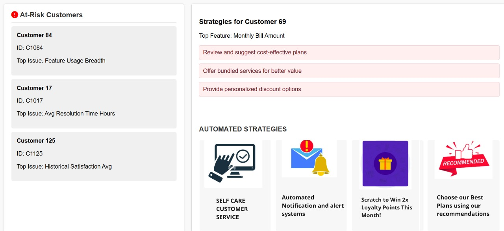

# Predictive-Customer-Retention-A-Telecom-Solution

### Telecom companies face significant challenges with customer churn, often losing subscribers due to dissatisfaction. This project explores a novel solution for proactively identifying and addressing customer dissatisfaction before it leads to churn.


### To set up Groqcloud 

- https://console.groq.com/keys
- Get an API key
- Create a file .env
- paste API Key with reference to env


### To Run app.py

```
pip install -r requirements.txt
```

```
python app.py
```

#### LLM Model used: llama3-8b-8192

### Final Output 

